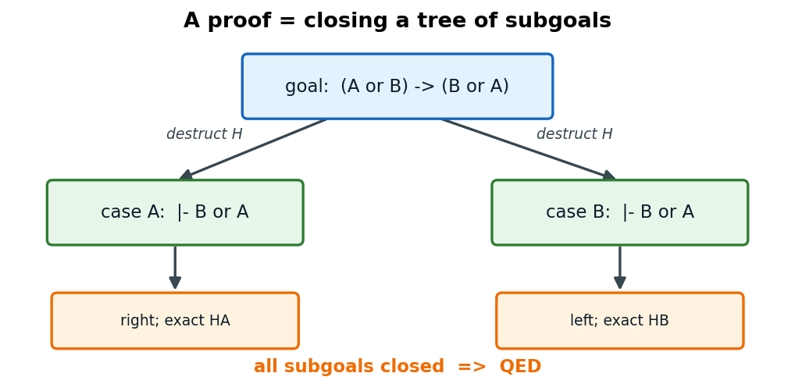
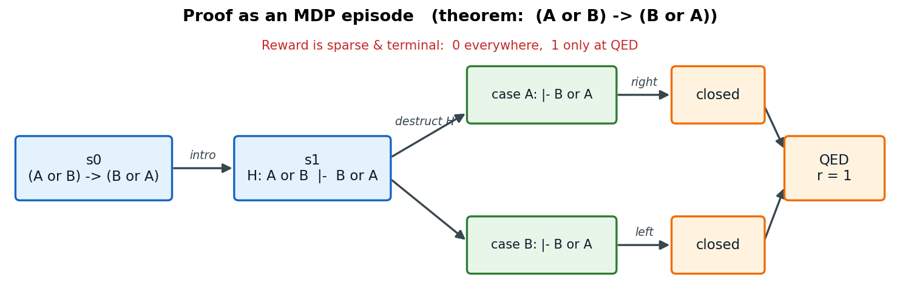
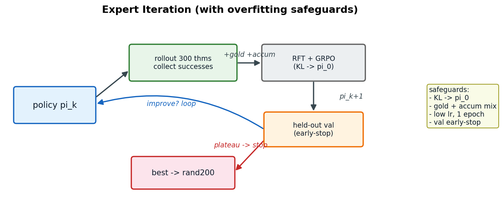

# Rango + 강화학습 — Coq 증명 자동화 성능 개선

발표 자료 초안 v3. 협업: **이종민 교수(연세대, RL 전문)**. 청중 = **RL에 밝고 Coq/증명자동화는 처음**.
> 편집 노트: 그림은 `presentation/figures/*.png`(코드 생성, `gen_figures.py`). `[원본그림]`=논문 figure로 교체 권장. `[TODO]`=수치/출처 확인.

---

## 1. Coq이란? — 가장 간단한 예시

**Coq** = 명제를 **형식적으로 기술하고 컴퓨터가 검증**하는 증명 보조기. 사람이 **tactic**으로 goal을 닫아감.

가장 직관적인 예 — **"A 그리고 B이면, A이다"**:
```coq
Theorem and_elim : forall A B : Prop, A /\ B -> A.
Proof.
  intros A B H.          (* 가정  H : A /\ B  도입 *)
  destruct H as [HA HB]. (* H를  HA:A,  HB:B  로 분해 *)
  exact HA.              (* 목표 A 는 HA 로 닫힘 *)
Qed.
```

**goal state가 tactic으로 변하는 과정:**
```
 시작:   A B : Prop,   H : A /\ B      |-   A
   │  destruct H
   ▼
        A B : Prop,   HA : A,  HB : B  |-   A      --exact HA-->  닫힘  ->  QED
```
- `|-` 왼쪽 = 가정, 오른쪽 = **goal(증명 대상)**. tactic이 가정·goal을 바꿔가며 닫음.

---

## 2. 경우 분석 & subgoal — "A 또는 B이면 B 또는 A"

```coq
Theorem or_comm : forall A B : Prop, A \/ B -> B \/ A.
Proof.
  intros A B H.
  destruct H as [HA | HB].  (* 경우 분석: H 가 A 이거나 B *)
  - right. exact HA.        (* case A:  목표 B\/A  ->  오른쪽(A) 선택 *)
  - left.  exact HB.        (* case B:  목표 B\/A  ->  왼쪽(B) 선택 *)
Qed.
```
- `destruct H` (∨에 대한 경우 분석)가 goal을 **2개의 subgoal**(case A / case B)로 쪼갬.
- 각 subgoal을 닫고 **모두 닫히면 → QED**.



---

## 3. Background — Coq은 진짜 수학에 쓰인다

- **4색 정리**(Four Color Theorem)의 형식 증명이 Coq으로 완성됨 (Gonthier 2008 [Four-Color]).
- 최근 **LLM은 (순수)수학 정리 증명을 잘 함** — 올림피아드급 벤치 **miniF2F 80%+** (예: DeepSeek-Prover-V2 **88.9%** [DeepSeek-Prover-V2]).
- ⇒ **"수학을 이렇게 잘 푸는데, 소프트웨어 검증도 자동화되지 않을까?"**

---

## 4. Formal Verification & CompCert

- **형식 검증**: 소프트웨어 동작을 수학으로 옮겨 **"버그 없이 명세대로 동작함"을 증명**.
- **CompCert** — C 컴파일러의 의미를 Coq으로 모델링, **"컴파일이 프로그램의 의미를 보존한다"**를 증명한 **검증된 컴파일러**.

```coq
(* CompCert 최상위 정리 (개념적 형태) *)
Theorem transf_c_program_correct :
  forall p tp,
  transf_c_program p = OK tp ->           (* p를 컴파일해 tp를 얻었으면 *)
  backward_simulation (Csem p) (Asm tp).  (* tp의 모든 동작은 p의 동작에 대응 *)
```
- 컴파일러가 **몰래 잘못된 기계어를 내지 않음**을 수학적으로 보장 (항공·자동차·OS 등).
> [원본그림] CompCert 파이프라인(C → … → Asm, 단계별 의미보존) 삽입 권장.

---

## 5. 증명 자동 생성 — 왜 어려운가

- **사람이 직접 증명 작성 = 매우 노동집약적.** 간단한 명제도 여러 tactic·lemma 필요, CompCert 실제 정리는 **수십~수백 줄**이 흔함.
- 도메인별 난이도 격차가 큼:


**CompCert 전정리(whole-theorem) 자동증명 — 전부 40% 미만:**

| 방법 | 유형 | CompCert pass@1 |
|---|---|---|
| Proverbot9001 (2020) [Proverbot9001] | search | ~19–21% |
| Tactician (k-NN) [TacticianWeb] | search | 23.4% |
| **Rango (2024) [Rango]** | LLM+retrieval | **32.5%** (현 최고) |

- 조건: CoqStoq CompCert 전정리, **pass@1, 10분**. 대조 — 순수수학(miniF2F, Lean): DeepSeek-Prover-V2 **88.9%** [DeepSeek-Prover-V2] · Goedel 57.6% [Goedel] · Lean-STaR 46.3% [Lean-STaR].
> 주의: 수학 수치는 대규모 샘플링(pass@8192), CompCert는 pass@1/10분 — 예산이 다름. 그래도 격차(80–89% vs 20–33%)는 크고 실재.
> 참고(정확성): ASTactic/TacTok/Diva/Passport는 **CoqGym 전체 평균(~12–22%)**이라 CompCert 단독 수치가 아님. QEDCartographer 97.6%는 정리가 아닌 **subgoal·오라클 필터** 결과라 여기 표와 비교 불가. (출처: References 슬라이드)

---

## 6. Rango — 우리가 개선할 base

- **Rango** [Rango]: Coq tactic 생성기.
  - base = **DeepSeek-Coder 1.3B** 를 Coq 증명으로 **fine-tune**.
  - **Retrieval-augmented** — 프롬프트에 **유사 증명(BM25)** + **관련 lemma(TF-IDF)** 를 넣어줌.


> [원본그림] Rango 논문 아키텍처 figure로 교체 권장.
- 한계: **CompCert 성공률 여전히 낮음(우리 측정 ~37%).** → **목표: 여기에 RL 적용해 개선.**

---

## 7. 강화학습 모델링 (핵심 — RL 관점)

| 요소 | 정의 |
|---|---|
| **State** s | 현재 **goal state** (명제+가정, + retrieved premises) |
| **Action** a | 다음 **tactic** |
| **Policy** π_θ(a\|s) | **LLM**이 프롬프트→tactic 토큰 확률분포 생성. **θ=LLM 파라미터 → LLM이 곧 policy network** |
| **Reward** | **QED = 1, 그 외 0** (sparse · terminal) |
| **Episode** | 정리 시작 → tactic 반복 → **QED까지의 여정** |

**실제 증명(`or_comm`)을 하나의 episode로:**



- RL 난점(교수님 관심): **극도로 sparse**(거의 모든 step r=0) · **긴 horizon** · **거대 이산 action space** · 중간 `V(s)` 추정 곤란.

---

## 8. 공통 실험 세팅

- **도메인**: 우선 **CompCert만**.
- **데이터**: 전체 ~**6000** 정리 중 앞 **1500** → **test 1200 / train 300**.
- **평가**: 별도 held-out **rand200**, 정리당 **600s** timeout, 공정 밀도(w2).
- **GRPO** [GRPO/DeepSeekMath]: 정리당 **G개 rollout** → 그룹 상대 advantage `Âᵢ=(rᵢ−mean)/std`. **critic-free**(그룹평균=baseline).
```
정리 T:  rollout ×8  →  rewards = [1,0,0,1,0,0,0,1]
         Âᵢ = (rᵢ − mean)/std   → 성공 +, 실패 −  (그룹 내 상대비교)
```

---

## 9. 실험 Set 1 — SFT / GRPO / SFT→GRPO


- SFT 33.5% → **SFT→GRPO 37.5%(최고)**, 그러나 **개선폭 작음.**
> 주의: 우리 수치는 **rand200(200정리, w2, 600s) 자체 프로토콜** — §5의 published(전체 6091, pass@1) 수치와 **직접 비교 대상 아님**. 개선은 **우리 SFT 33.5% baseline 대비**로만 해석.
- 원인 — **dead group(신호 부족):**


- 실제 학습 신호를 주는 **mixed는 ~31%뿐**, dead+all(69%)은 gradient 0 = **sparse reward.**

---

## 10. 실험 Set 2 — SFT→GRPO 반복 (overfitting?)

- **가설**: GRPO로 푼 정리를 SFT로 강화 반복 → 다음 rollout에서 **mixed↑** → 성능↑?
- **결과**: train은 좋아지는데 **held-out은 정체/하락.**


- ⇒ **overfitting 의심** (자기 성공을 반복 모방하며 train 300개에 과적합).

---

## 11. 실험 Set 3 — Expert Iteration (안전장치)

**Expert Iteration** = 정책으로 풀어보고 → **검증된 성공만** 모아 재학습 → 반복. (STaR [STaR] / ReST-EM [ReST-EM] 계열, on-policy라 안전)



**결과 (진행 중):** 라운드별 held-out(val 60) = **R1 38.3% ≈ R2 38.3% → 조기중단**. **collapse 없음**(Set2 하락과 대조 = 안전장치 유효). 최종 rand200(best=R1) vs 37.5% = **[TODO 오늘 결과]**.

---

## 12. 앞으로 — PPO & critic

- GRPO는 **episode 단위 outcome**로 학습 → 여전히 sparse.
- **PPO** [PPO]: **critic V(s)**로 **step 단위 advantage** → 한 rollout 안에서도 중간 신호로 update → sparse 완화 기대.
```
 GRPO:  [s0 a0 ... QED]  → 끝에서 r=1 한 번 → 전체에 상대 advantage
 PPO :  각 step  Â_t = r_t + γV(s_{t+1}) − V(s_t)   → step마다 신호
```
- **단, 좋은 critic 필수.** 예비 PPO: **critic 학습 실패**(sparse, explained variance ≈ 0). → **핵심 과제 = 학습 가능한 critic 설계** (교수님 RL 전문성이 필요한 지점).

---

## 13. 요약

- **도메인**: Coq/CompCert 형식 검증 — 자동증명 성공률 낮음(<40%).
- **흐름**: ① SFT→GRPO 최고지만 개선 미미(**dead group=sparse reward**) → ② 단순 반복은 **overfitting** → ③ 안전장치 **EI로 안정화**(붕괴는 막음).
- **근본 병목**: **sparse reward / dead group** — 신호 자체가 없음.
- **다음**: PPO(critic로 dense화), 도달성(reaching)·분해 학습으로 **신호를 만드는** 방향.

> 백업: GRPO advantage 유도, Rango retrieval 상세, 안전-EI 각 장치 근거 논문, dead group 실제 rollout 예시.
> 그림 재생성: `python3 presentation/gen_figures.py` (수치·라벨 수정 후).

---

## 14. References

**Coq / CompCert 증명 자동화**
- **[Rango]** Thompson et al. "Rango: Adaptive Retrieval-Augmented Proving for Automated Software Verification." ICSE 2025. arXiv:2412.14063
- **[Proverbot9001]** Sanchez-Stern et al. "Generating Correctness Proofs with Neural Networks." MAPL 2020. arXiv:1907.07794
- **[TacticianWeb]** Blaauwbroek et al. "The Tactician's Web of Large-Scale Formal Knowledge." 2024. arXiv:2401.02950
- **[Graph2Tac]** Blaauwbroek et al. "Graph2Tac: Online Representation Learning of Formal Math Concepts." ICML 2024. arXiv:2401.02949
- **[ASTactic/CoqGym]** Yang, Deng. "Learning to Prove Theorems via Interacting with Proof Assistants." ICML 2019. arXiv:1905.09381
- **[Passport]** Sanchez-Stern et al. "Passport: Improving Automated Formal Verification Using Identifiers." TOPLAS 2023. arXiv:2204.10370
- **[TacTok]** First, Brun, Guha. "TacTok: Semantics-Aware Proof Synthesis." OOPSLA 2020. doi:10.1145/3428299
- **[Diva]** First, Brun. "Diversity-Driven Automated Formal Verification." ICSE 2022. doi:10.1145/3510003.3510138
- **[QEDCartographer]** Sanchez-Stern et al. "QEDCartographer: Automating Formal Verification Using Reward-Free RL." ICSE 2025. arXiv:2408.09237

**수학(Lean) LLM prover — 대조**
- **[DeepSeek-Prover-V2]** DeepSeek-AI. "DeepSeek-Prover-V2." 2025. arXiv:2504.21801
- **[Goedel]** Lin, Tang et al. "Goedel-Prover." 2025. arXiv:2502.07640
- **[Lean-STaR]** Lin, Sun, Yang, Welleck. "Lean-STaR: Learning to Interleave Thinking and Proving." 2024. arXiv:2407.10040

**강화학습 / 방법론**
- **[GRPO/DeepSeekMath]** Shao et al. "DeepSeekMath: Pushing the Limits of Mathematical Reasoning." 2024. arXiv:2402.03300
- **[PPO]** Schulman et al. "Proximal Policy Optimization Algorithms." 2017. arXiv:1707.06347
- **[STaR]** Zelikman et al. "STaR: Bootstrapping Reasoning With Reasoning." NeurIPS 2022. arXiv:2203.14465
- **[ReST-EM]** Singh et al. "Beyond Human Data: Scaling Self-Training (ReST-EM)." 2023. arXiv:2312.06585
- **[Four-Color]** Gonthier. "Formal Proof — The Four-Color Theorem." Notices of the AMS, 2008.

> 검증: arXiv ID는 fetch로 확인됨. TacTok/Diva는 arXiv 없음(ACM) → DOI. CompCert 표는 whole-theorem·pass@1 기준(§5 주의문 참조).
