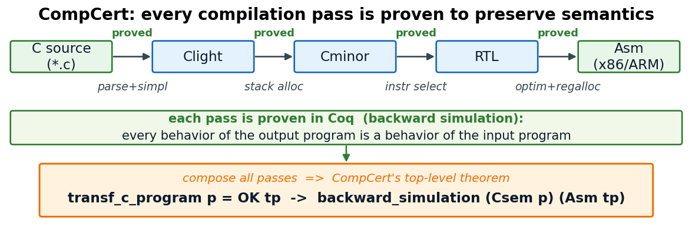
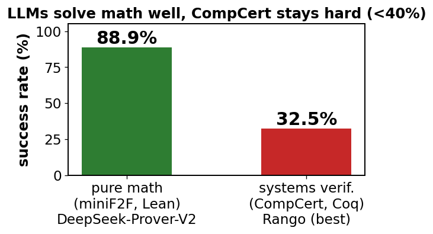
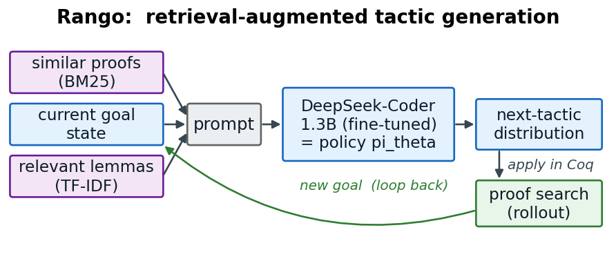
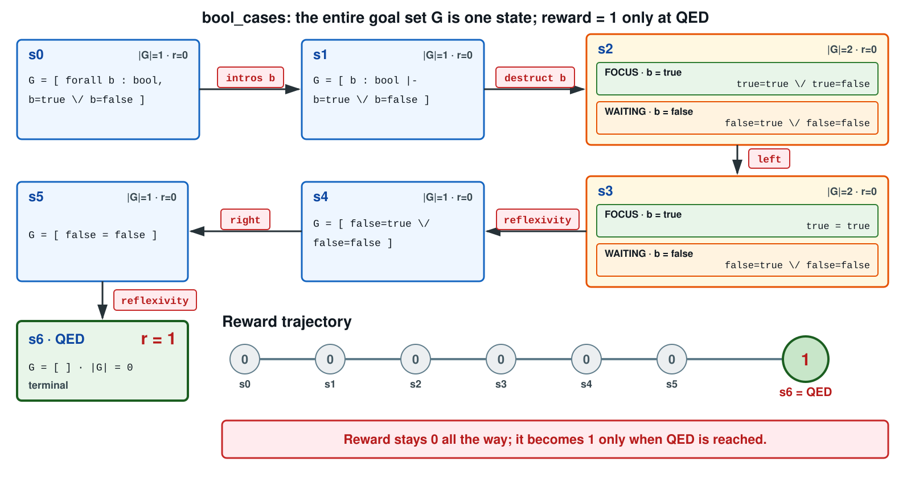
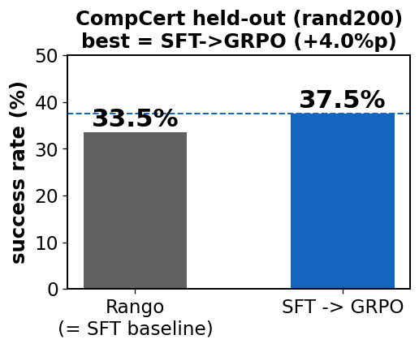
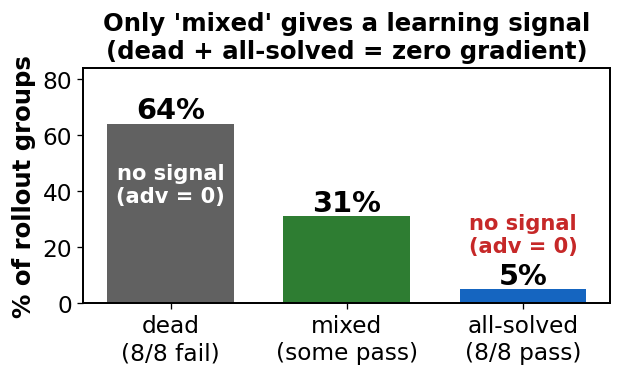
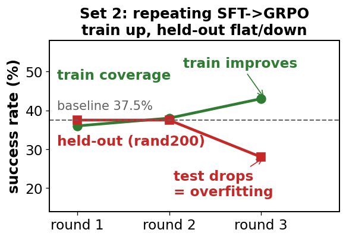

# Rango + 강화학습 — Coq 증명 자동화 성능 개선

<style>
section {
  font-family: "Noto Sans CJK KR", "Noto Sans KR", sans-serif;
  font-size: 20px;
  padding: 36px 48px;
}
h1 { font-size: 40px; }
h2 {
  font-size: 27px;
  margin-bottom: 12px;
}
h3 {
  font-size: 21px;
  margin: 10px 0 6px;
}
p, li { margin: 4px 0; }
pre {
  font-family: "Noto Sans Mono CJK KR", "Noto Sans Mono", monospace;
  font-size: 1em;
  line-height: 1.35;
  padding: 8px 10px;
}
code { font-size: 1em; }
table { font-size: 0.84em; }
td pre, th pre {
  font-size: 1.08em;
  margin: 0;
  padding: 4px 6px;
}
.proof-prefix {
  font-size: 1.08em;
  line-height: 1.25;
}
.episode-diagram {
  display: block;
  max-height: 370px;
  max-width: 100%;
  width: auto;
  height: auto;
  margin: 6px auto;
}
img[alt="results"] {
  display: block;
  max-height: 300px;
  width: auto;
}

.current-tactic {
  color: #2563EB;
  background: #EFF6FF;
  font-weight: 700;
  padding: 0 3px;
}
.goal-focused {
  border-left: 5px solid #1E40AF;
  background: #DBEAFE;
  color: #0F172A;
  font-weight: 600;
  padding: 6px 9px;
}
.goal-focused b {
  color: #172554;
  font-weight: 800;
}
.goal-focused pre {
  color: #0F172A;
  font-weight: 600;
}
.or-choice {
  margin: 5px 0;
  text-align: center;
  font-family: monospace;
  font-weight: 600;
}
.or-source {
  color: #475569;
}
.or-selected-left,
.or-selected-right {
  color: #172554;
  background: #BFDBFE;
  font-weight: 800;
  padding: 2px 4px;
}
.or-arrow {
  color: #1E40AF;
  font-family: sans-serif;
  font-weight: 800;
}
.or-result {
  color: #0F172A;
  font-weight: 800;
}
.goal-waiting {
  border-left: 5px solid #94A3B8;
  background: #F8FAFC;
  color: #64748B;
  padding: 6px 9px;
}
.premise-line {
  color: #166534;
  background: #DCFCE7;
  font-weight: 700;
}
/* 섹션 토글: 기본 open이라 발표/PDF 화면은 그대로, 미리보기에서 제목 클릭 시 접힘 */
details.sec > summary {
  cursor: pointer;
  list-style: none;
}
details.sec > summary::-webkit-details-marker {
  display: none;
}
details.sec > summary > h2::before {
  content: "▾";
  color: #94A3B8;
  font-size: 0.7em;
  margin-right: 0.3em;
  vertical-align: middle;
}
details.sec:not([open]) > summary > h2::before {
  content: "▸";
}
@media print {
  details.sec > summary > h2::before { content: none; }
}
</style>

<details class="sec" open>
<summary><h2>1. Coq이란? — 가장 간단한 예시</h2></summary>

- **Coq**: 수학 명제를 형식적으로 기술하고 컴퓨터가 검증하는 증명 도구
- **Goal**: 풀고자 하는 명제
- **Tactic**: goal을 단계적으로 바꾸거나 닫는 명령 (`.`으로 구분)
- **첫 예제**: $\forall n$, **0 + n = n**
```coq
Theorem zero_plus_n : forall n : nat, 0 + n = n.
Proof.
  intros n.      (* 자연수 n을 구체화 *)
  simpl.         (* 0 + n을 계산하면 goal은 n = n *)
  reflexivity.   (* 좌변과 우변이 같은 항 -> 즉시 증명 가능 *)
Qed.
```
- `Theorem ... : forall n : nat, 0 + n = n.` 로 **명제를 기술**,
- tactic: 단계 적으로 수항 명제를 담아줄 수 있는 도구.
- `Proof.` ~ `Qed.` 사이에서 **tactic으로 goal을 닫는다**.

</details>

---

<details class="sec" open>
<summary><h2>1-2. 한 줄씩 실행</h2></summary>

- **실행 방식**: tactic을 하나씩 수행할 때마다 goal이 변화
- 왼쪽 = **코드 prefix (빨강 = 현재 실행)**
- 오른쪽 = **goal 창**

<!-- Coq 8.18 실측 -->
<table>
<tr><th align="left" width="46%">현재까지 실행한 코드</th><th align="left">Coq가 보여주는 goal 상태</th></tr>
<tr><td><b>단계 1</b><pre class="proof-prefix"><span class="current-tactic">Theorem zero_plus_n : forall n : nat, 0 + n = n.</span></pre>명제 선언 → <b>goal 1개 생성</b></td><td><pre>1 goal
  ============================
  forall n : nat, 0 + n = n</pre><code>n</code>이 아직 goal 안에 있음</td></tr>
<tr><td><b>단계 2</b><pre class="proof-prefix">Theorem zero_plus_n : forall n : nat, 0 + n = n.
<span class="current-tactic">Proof.</span></pre><b>tactic 시작</b> 구분선</td><td><pre>1 goal
  ============================
  forall n : nat, 0 + n = n</pre><b>변화 없음</b></td></tr>
<tr><td><b>단계 3</b><pre class="proof-prefix">Theorem zero_plus_n : forall n : nat, 0 + n = n.
Proof.
  <span class="current-tactic">intros n.</span></pre><code>n</code>을 context로 도입</td><td><pre>1 goal
  n : nat
  ============================
  0 + n = n</pre><code>n</code>이 goal에서 <b>context로 이동</b></td></tr>
</table>

</details>

---

<details class="sec" open>
<summary><h2>1-2. 한 줄씩 실행 (계속)</h2></summary>

<table>
<tr><td><b>단계 4</b><pre class="proof-prefix">Theorem zero_plus_n : forall n : nat, 0 + n = n.
Proof.
  intros n.
  <span class="current-tactic">simpl.</span></pre><code>0 + n</code>을 계산해 단순화</td><td><pre>1 goal
  n : nat
  ============================
  n = n</pre><code>0 + n = n</code>이 <code>n = n</code>으로 변함</td></tr>
<tr><td><b>단계 5</b><pre class="proof-prefix">Theorem zero_plus_n : forall n : nat, 0 + n = n.
Proof.
  intros n.
  simpl.
  <span class="current-tactic">reflexivity.</span></pre><code>x = x</code> 꼴이면 <b>닫는 tactic</b></td><td><pre>No more goals.</pre><b>기존 goal 1이 참임을 증명</b></td></tr>
<tr><td><b>단계 6</b><pre class="proof-prefix">Theorem zero_plus_n : forall n : nat, 0 + n = n.
Proof.
  intros n.
  simpl.
  reflexivity.
<span class="current-tactic">Qed.</span></pre><b>증명 종료</b> 선언</td><td>증명 완료 선언</td></tr>
</table>

</details>

---

<details class="sec" open>
<summary><h2>2. 다른 예시 "bool 값은 true 아니면 false"</h2></summary>

- **목표**: `destruct`가 여러 subgoal을 만드는 과정을 확인

```coq
Theorem bool_cases : forall b : bool, b = true \/ b = false.
Proof.
  intros b.
  destruct b.             (* b 가 true 이거나 false *)
  - left.  reflexivity.   (* b = true: true  = true   로 닫힘 *)
  - right. reflexivity.   (* b = false:  false = false  로 닫힘 *)
Qed.
```
- `destruct b`
- $\rightarrow$ goal을 **2개의 subgoal**(b=true인 경우 / b=false인 경우)로 쪼갬.
- 각 subgoal을 닫고 **모두 닫히면 → QED**.

</details>

---

<details class="sec" open>
<summary><h2>2-2. 한 줄씩 실행하면</h2></summary>

- 왼쪽 = **코드 prefix (빨강 = 현재 실행)**
- 오른쪽 = **goal 창**

<!-- Coq 8.18 실측 -->
<table>
<tr><th align="left" width="46%">현재까지 실행한 코드</th><th align="left">Coq가 보여주는 goal 상태</th></tr>
<tr><td><b>단계 1</b><pre class="proof-prefix"><span class="current-tactic">Theorem bool_cases : forall b : bool,
  b = true \/ b = false.</span></pre>명제 선언 → <b>goal 1개 생성</b></td><td><pre>1 goal
  ============================
  forall b : bool,
    b = true \/ b = false</pre><code>forall b</code>가 아직 goal에 있음</td></tr>
<tr><td><b>단계 2</b><pre class="proof-prefix">Theorem bool_cases : forall b : bool,
  b = true \/ b = false.
<span class="current-tactic">Proof.</span></pre><b>tactic 시작</b> 구분선</td><td><pre>1 goal
  ============================
  forall b : bool,
    b = true \/ b = false</pre><b>변화 없음</b></td></tr>
<tr><td><b>단계 3</b><pre class="proof-prefix">Theorem bool_cases : forall b : bool,
  b = true \/ b = false.
Proof.
  <span class="current-tactic">intros b.</span></pre>임의의 <code>b</code>를 고정하는 <b>∀-도입</b></td><td><pre>1 goal
  b : bool
  ============================
  b = true \/ b = false</pre><code>b</code>가 goal에서 <b>context로 이동</b></td></tr>
</table>

</details>

---

<details class="sec" open>
<summary><h2>2-2. 한 줄씩 실행 (계속)</h2></summary>

<table>
<tr><td><b>단계 4</b><pre class="proof-prefix">Theorem bool_cases : forall b : bool,
  b = true \/ b = false.
Proof.
  intros b.
  <span class="current-tactic">destruct b.</span></pre><code>bool</code>의 두 생성자에 대해 <b>경우 분석</b></td><td><b>2 goals</b>
<div class="goal-case goal-true"><b class="goal-label">GOAL 1 · CASE b = true</b><pre>============================
true = true \/ true = false</pre></div>
<div class="goal-case goal-false"><b class="goal-label">GOAL 2 · CASE b = false</b><pre>============================
false = true \/ false = false</pre></div>
<b>goal 1 → 2</b>: <code>b</code>가 각 case의 값으로 치환됨</td></tr>
<tr><td><b>단계 5</b><pre class="proof-prefix">Theorem bool_cases : forall b : bool,
  b = true \/ b = false.
Proof.
  intros b.
  destruct b.
  <span class="current-tactic">-</span></pre>bullet로 첫 번째 subgoal에 <b>focus</b></td><td><b>1 focused goal</b>
<div class="goal-focused"><b>FOCUSED · GOAL 1 · CASE b = true</b><pre>============================
true = true \/ true = false</pre></div>
<div class="goal-waiting"><b>WAITING · GOAL 2 · CASE b = false</b><br>GOAL 2는 현재 focus 밖에서 대기</div></td></tr>
</table>

</details>

---

<details class="sec" open>
<summary><h2>2-2. 한 줄씩 실행 (계속)</h2></summary>

<table>
<tr><td><b>단계 6</b><pre class="proof-prefix">Theorem bool_cases : forall b : bool,
  b = true \/ b = false.
Proof.
  intros b.
  destruct b.
  - <span class="current-tactic">left.</span></pre>focused goal에서 ∨의 <b>왼쪽</b>을 선택</td><td><b>1 focused goal</b>
<div class="goal-focused"><b>FOCUSED · GOAL 1 · CASE b = true — LEFT 선택</b>
<div class="or-choice"><div class="or-source"><span class="or-selected-left">true = true</span> ∨ true = false</div><div class="or-arrow">↓ left</div><div class="or-result">true = true</div></div>
<pre>============================
true = true</pre></div>
<div class="goal-waiting"><b>WAITING · GOAL 2 · CASE b = false</b><br>GOAL 1이 닫힐 때까지 대기</div></td></tr>
<tr><td><b>단계 7</b><pre class="proof-prefix">Theorem bool_cases : forall b : bool,
  b = true \/ b = false.
Proof.
  intros b.
  destruct b.
  - left. <span class="current-tactic">reflexivity.</span></pre><span style="color:#2e7d32"><b>b = true</b></span> case를 닫음</td><td><b>1 goal</b>
<div class="goal-case goal-false"><b class="goal-label">남은 GOAL 2 · CASE b = false</b><pre>============================
false = true \/ false = false</pre></div>
<b>goal 2 → 1</b>: <code>b = false</code> case만 남음</td></tr>
</table>

</details>

---

<details class="sec" open>
<summary><h2>2-2. 한 줄씩 실행 (계속)</h2></summary>

<table>
<tr><td><b>단계 8</b><pre class="proof-prefix">Theorem bool_cases : forall b : bool,
  b = true \/ b = false.
Proof.
  intros b.
  destruct b.
  - left. reflexivity.
  - <span class="current-tactic">right.</span></pre><span style="color:#ef6c00"><b>b = false</b></span> case에서 ∨의 <b>오른쪽</b>을 선택</td><td><b>1 goal</b>
<div class="goal-focused"><b>FOCUSED · GOAL 2 · CASE b = false — RIGHT 선택</b>
<div class="or-choice"><div class="or-source">false = true ∨ <span class="or-selected-right">false = false</span></div><div class="or-arrow">↓ right</div><div class="or-result">false = false</div></div>
<pre>============================
false = false</pre></div>
목표가 <code>false = false</code>로 줄어듦</td></tr>
<tr><td><b>단계 9</b><pre class="proof-prefix">Theorem bool_cases : forall b : bool,
  b = true \/ b = false.
Proof.
  intros b.
  destruct b.
  - left. reflexivity.
  - right. <span class="current-tactic">reflexivity.</span></pre><code>x = x</code> 꼴인 마지막 subgoal을 닫음</td><td><pre>No more goals.</pre><b>goal 1 → 0</b> = 모든 subgoal이 닫힘</td></tr>
</table>

</details>

---

<details class="sec" open>
<summary><h2>2-2. 한 줄씩 실행 (계속)</h2></summary>

<table>
<tr><td><b>단계 10</b><pre class="proof-prefix">Theorem bool_cases : forall b : bool,
  b = true \/ b = false.
Proof.
  intros b.
  destruct b.
  - left. reflexivity.
  - right. reflexivity.
<span class="current-tactic">Qed.</span></pre><b>증명 종료</b> 선언</td><td>(출력 없음)<br>goal 0개라 통과 → <b><code>bool_cases</code> 등록</b></td></tr>
</table>


</details>

---

| tactic | 남은 goal | 하는 일 | 논리 규칙 |
|---|---|---|---|
| `intros b` | 1 → 1 | ∀의 변수를 context로 올림 | ∀I |
| `destruct b` | 1 → **2** | 생성자별 경우 분석, 목표의 `b`를 치환 | 경우 분석(귀납 원리) |
| `left` / `right` | 2 → 2 | 목표 `_ \/ _` 의 한쪽을 선택 | ∨I |
| `reflexivity` | 2 → 1 → **0** | `x = x` 를 `eq_refl`로 닫음 | refl |

### RL 관점 미리보기

- **State**: 현재 `proof state`
- **Action**: 다음에 실행할 `tactic`
- **Transition**: tactic 실행에 따른 `subgoal tree`의 분기와 변화
- **Reward**: 모든 goal을 닫아 **Qed에 도달하면 1**, 그 외에는 0
- **핵심 난점**: 성공 직전까지도 보상이 없는 **희소 보상(sparse reward)**

- **다음 연결**: 뒤에서 다룰 탐색과 GRPO가 바로 이 subgoal tree 위에서 동작

---

<details class="sec" open>
<summary><h2>2-3. premise — 이미 증명된 정리를 가져다 쓰기</h2></summary>

- **Premise**: 앞에서 이미 증명해 두어 새 증명에서 가져다 쓸 수 있는 정리

```coq
(* 먼저 증명해 둔 lemma가 이후 증명의 premise가 된다. *)
Lemma zero_plus : forall n : nat, 0 + n = n.
Proof.
  intros n. simpl. reflexivity.
Qed.

(* Target theorem: premise를 사용해 새로 증명할 명제 *)
Theorem zero_plus_twice : forall n : nat,
  0 + (0 + n) = n.
Proof.
  intros n.
  rewrite zero_plus.
  simpl.
  reflexivity.
Qed.
```

</details>

---

<details class="sec" open>
<summary><h2>2-3. premise — rewrite 전후 goal 변화</h2></summary>

- **아래 표**: `intros n.` 이후 premise로 goal을 줄이는 과정

<table>
<tr><th align="left" width="52%">현재까지 실행한 코드</th><th align="left">Coq가 보여주는 goal 상태</th></tr>
<tr><td><b>premise 사용</b><pre class="proof-prefix">Theorem zero_plus_twice : forall n : nat,
  0 + (0 + n) = n.
Proof.
  intros n.
  <span class="current-tactic">rewrite zero_plus.</span></pre></td><td><b>rewrite 전</b><pre>1 goal
  n : nat
  ============================
  <span style="color:#FBBF24; font-weight:700;">0 + (0 + n)</span> = n</pre>
<div style="margin:6px 0; color:#E2E8F0;"><code style="color:#F8FAFC; background:#334155;">zero_plus</code>에서 <code style="color:#F8FAFC; background:#334155;">n := 0 + n</code>으로 맞춤</div>
<div style="text-align:center; color:#F8FAFC; font-weight:800;"><code style="color:#FBBF24; background:#334155;">0 + (0 + n)</code> → <code style="color:#4ADE80; background:#334155;">0 + n</code></div>
<b>rewrite 후</b><pre>1 goal
  n : nat
  ============================
  <span style="color:#4ADE80; font-weight:700;">0 + n</span> = n</pre>
goal에서 일치한 부분만 premise 등식의 오른쪽 항으로 치환되고, 바깥의 <code>= n</code>은 그대로 유지</td></tr>
</table>

- `rewrite`: premise를 이용해 goal의 일부를 바꿈
- 실제 난점은 **수만 개의 lemma 중 어떤 premise를 가져올지 찾는 것**이며, Rango는 retrieval로 후보를 좁힌다.

</details>

---

<details class="sec" open>
<summary><h2>3. Background — Coq은 진짜 수학에 쓰인다</h2></summary>

- **4색 정리**(Four Color Theorem)의 형식 증명이 Coq으로 완성됨 (Gonthier 2008 [Four-Color]).
- 최근 **LLM은 (순수)수학 정리 증명을 잘 함** — 올림피아드급 벤치 **miniF2F 80%+** (예: DeepSeek-Prover-V2 **88.9%** [DeepSeek-Prover-V2]).
- ⇒ **"수학을 이렇게 잘 푸는데, 소프트웨어 검증도 자동화되지 않을까?"**

</details>

---

<details class="sec" open>
<summary><h2>4. Formal Verification & CompCert</h2></summary>

- **형식 검증**: 소프트웨어 동작을 수학으로 옮겨 **"버그 없이 명세대로 동작함"을 증명**.
- **CompCert** — C 컴파일러의 의미를 Coq으로 모델링, **"컴파일이 프로그램의 의미를 보존한다"**를 증명한 **검증된 컴파일러**.

### 4.1 작은 정수 판별 함수

```coq
(* CompCert/lib/Integers.v *)
Lemma is_power2_correct:
  forall n logn,
  is_power2 n = Some logn ->
  unsigned n = two_p (unsigned logn).
```

- `is_power2 n = Some logn`: CompCert가 `n`을 $2^{logn}$ 꼴이라고 판별
- 결론: 실제 정수 값도 정말 **$n = 2^{logn}$**
- 예: `is_power2 8 = Some 3`이면 실제로 **$8 = 2^3$**
- 상수 곱셈과 나눗셈을 빠른 **bit shift**로 바꿀 때 이 성질을 사용

</details>

---

<details class="sec" open>
<summary><h2>4.2 메모리에 쓴 값은 다시 읽을 수 있는가?</h2></summary>

### CompCert 메모리 모델의 실제 정리

```coq
(* CompCert/common/Memory.v *)
Hypothesis STORE:
  store chunk m1 b ofs v = Some m2.

Theorem load_store_same:
  load chunk m2 b ofs =
  Some (Val.load_result chunk v).
```

- `m1`: 쓰기 전 메모리, `m2`: 쓰기 후 메모리
- `b, ofs`: 값을 저장한 메모리 위치, `v`: 저장한 값
- **정리의 의미**: `v`를 저장한 바로 그 위치에서 다시 읽으면 `v`가 나온다
- `Val.load_result`는 저장 크기(`chunk`)에 맞춰 값을 해석한 결과

- **역할**: 실제 CPU와 C 프로그램의 load/store를 연결하는 기반 정리

</details>

---

<details class="sec" open>
<summary><h2>4.3 계층을 연결하는 backward simulation</h2></summary>

```coq
(* CompCert 최상위 정리 *)
Theorem transf_c_program_correct :
  forall p tp,
  transf_c_program p = OK tp ->
  backward_simulation (Csem p) (Asm tp).
```

- `p`: 컴파일 전 **C source program**
- `tp`: 컴파일 후 만들어진 **target assembly program**
- `transf_c_program p = OK tp`: `p`를 오류 없이 컴파일해 `tp`를 얻음
- `Csem p` / `Asm tp`: 각각 C 프로그램과 Assembly 프로그램의 실행 의미



</details>

---

<details class="sec" open>
<summary><h2>4.3 backward simulation — 파이프라인으로 연결</h2></summary>


- **축약 그림**: 실제 **11개 언어와 약 20개 pass**를 핵심 5개 언어로 줄여 표현
- **각 pass마다** "출력 프로그램의 모든 동작은 입력 프로그램의 동작이다"(backward simulation)를 Coq으로 증명.
- 이 증명들을 **이어 붙이면**, Assembly의 모든 동작이 원본 C의 동작과 대응한다.
- 작은 정수·메모리 정리부터 계층별 simulation까지 쌓여 **컴파일러 전체의 정확성**이 된다.

</details>

---

<details class="sec" open>
<summary><h2>5. 증명 자동 생성 — 왜 어려운가</h2></summary>

- **사람이 직접 증명 작성 = 매우 노동집약적.** 간단한 명제도 여러 tactic·lemma 필요, CompCert 실제 정리는 **수십~수백 줄**이 흔함.
- 도메인별 난이도 격차가 큼:



</details>

---

<details class="sec" open>
<summary><h2>5-2. CompCert 전정리(whole-theorem) 자동증명 — 전부 40% 미만</h2></summary>

| 방법 | 유형 | CompCert pass@1 |
|---|---|---|
| Proverbot9001 (2020) [Proverbot9001] | search | ~19–21% |
| Tactician (k-NN) [TacticianWeb] | search | 23.4% |
| **Rango (2024) [Rango]** | LLM+retrieval | **32.5%** (현 최고) |

- **CompCert 조건**: CoqStoq CompCert 전정리, **pass@1, 제한 시간 10분**
- **순수수학 조건**: miniF2F, Lean 기준의 대규모 샘플링
- **순수수학 결과**: DeepSeek-Prover-V2 **88.9%**, Goedel **57.6%**, Lean-STaR **46.3%**

### 수치 해석 시 주의

- **평가 예산이 다름**: 수학은 대규모 샘플링 `pass@8192`, CompCert는 `pass@1 / 10분`
- **격차는 분명함**: 평가 조건 차이를 감안해도 수학 **80–89%**, CompCert **20–33%**

</details>

---

<details class="sec" open>
<summary><h2>6. Rango — 우리가 개선할 base</h2></summary>

- **Rango** [Rango]: Coq tactic 생성기
- **Base model**: DeepSeek-Coder 1.3B를 Coq 증명으로 fine-tune
- **Retrieval**: 프롬프트에 유사 증명(BM25)과 관련 lemma(TF-IDF)를 추가



- **한계**: CompCert 성공률이 여전히 낮음(우리 측정 약 37%)
- **목표**: Rango에 RL을 적용해 성공률 개선

</details>

---

<details class="sec" open>
<summary><h2>7. 강화학습 모델링 (핵심 — RL 관점)</h2></summary>

| 요소 | 정의 |
|---|---|
| **State** s | 현재 **proof state = 열린 subgoal 집합 전체** (각 subgoal = 가정+목표, + retrieved premises) |
| **Action** a | 다음 **tactic** |
| **Policy** π_θ(a\|s) | **LLM**이 프롬프트→tactic 토큰 확률분포 생성. **θ=LLM 파라미터 → LLM이 곧 policy network** |
| **Reward** | **QED = 1, 그 외 0** (sparse · terminal) |
| **Episode** | 정리 시작 → tactic 반복 → **QED까지의 여정** |

</details>

---

<details class="sec" open>
<summary><h2>7-2. §2의 증명(<code>bool_cases</code>)을 하나의 episode로</h2></summary>

- **State**: 열린 subgoal 전체의 집합 `G`
- **Reward**: `G = ∅`이 되는 **QED 순간에만 1**, 그 외에는 0



</details>

---

<details class="sec" open>
<summary><h2>8. 공통 실험 세팅</h2></summary>

- **원본 데이터**: 여러 Coq 프로젝트를 모은 **CoqStoq benchmark**
- **도메인 선택**: CoqStoq **TEST split**에서 **CompCert** 선택
- **실험 분할**: Compcert 전체 6,091개 중 앞 **1,500개** → **test 1,200 / train 300**
- **rand200**: test 1200개 중 **무작위로 추출한 200개 정리**
- **평가**: held-out **rand200**, 정리당 **600초 timeout**
- **GRPO** : 정리당 **G(=8)개 rollout** → 그룹 상대 advantage `Âᵢ=(rᵢ−mean)/std`.
```
정리 T:  rollout ×8  →  rewards = [1,0,0,1,0,0,0,1]
         Âᵢ = (rᵢ − mean)/std   → 성공 +, 실패 −  (그룹 내 상대비교)
```

</details>

---

<details class="sec" open>
<summary><h2>9. 실험 Set 1 — SFT / GRPO / SFT→GRPO</h2></summary>



- **최고 결과**: SFT 33.5% → **SFT→GRPO 37.5%**
- **해석**: 성능은 올랐지만 **개선폭은 작음**

</details>

---

<details class="sec" open>
<summary><h2>9-2. 원인 — <strong>dead group(신호 부족)</strong></h2></summary>



- 실제 학습 신호를 주는 **mixed는 ~31%뿐**, dead+all(69%)은 gradient 0 = **sparse reward.**

</details>

---

<details class="sec" open>
<summary><h2>9-3. 왜 dead group은 학습 신호가 0인가?</h2></summary>

- **그룹과 인덱스**: 한 정리에서 $G$개 rollout을 생성; $i$는 tactic 단계가 아니라 **$i$번째 전체 rollout** ($G=8$)
- **Binary reward**: QED 성공만 1, 나머지는 0; **부분 점수 없음**

$$\color{#0369A1}{r_i=\mathbf{1}[\text{rollout }i\text{가 QED 도달}]\in\{0,1\}}$$

- **Group-relative advantage**: 같은 정리의 reward 평균·표준편차로 각 rollout을 상대 평가

$$
\mu_G=\frac{1}{G}\sum_{i=1}^{G}r_i,\qquad
\sigma_G=\sqrt{\frac{1}{G}\sum_{i=1}^{G}(r_i-\mu_G)^2},\qquad
\color{#1D4ED8}{\hat A_i=\frac{r_i-\mu_G}{\sigma_G+\epsilon_{\mathrm{std}}}}
\quad(\epsilon_{\mathrm{std}}=10^{-4})
$$

| 그룹 | rewards | advantage | 학습 신호 |
|---|---|---|---|
| **Dead** | $[0,\ldots,0]$ | 모든 $\hat A_i=0$ | 없음 |
| **Mixed** | 0과 1이 섞임 | 성공 $+$ / 실패 $-$ | **있음** |
| **All-success** | $[1,\ldots,1]$ | 모든 $\hat A_i=0$ | 없음 |

</details>

---

<details class="sec" open>
<summary><h2>9-4. Loss에서 gradient가 나오는 과정</h2></summary>

- **Token 인덱스 $t$**: rollout $i$ 안의 tactic completion token; 같은 $\hat A_i$를 모든 tactic step과 token에 적용

$$\color{#0369A1}{
\rho_{i,t}(\theta)=\exp\!\left(\log\pi_\theta(a_{i,t}\mid s_{i,t})-\log\pi_{\mathrm{old}}(a_{i,t}\mid s_{i,t})\right)
}$$

- **Clipped loss**: $\varepsilon_{\mathrm{clip}}=0.2$, $\beta=0.04$; advantage 방향으로 학습하되 변화량을 제한

$$\color{#4338CA}{
L(\theta)=-\operatorname{mean}_{i,t}\!\left[
\min\!\left(\rho_{i,t}\hat A_i,\operatorname{clip}(\rho_{i,t},1-\varepsilon_{\mathrm{clip}},1+\varepsilon_{\mathrm{clip}})\hat A_i\right)
-\beta D_{\mathrm{KL}}^{i,t}(\pi_\theta\Vert\pi_{\mathrm{ref}})\right]
}$$

- **Clip 이전의 update 방향**

$$
\nabla_\theta\ell_{\mathrm{policy}}
=-\hat A_i\rho_{i,t}\nabla_\theta\log\pi_\theta(a_{i,t}\mid s_{i,t})
\quad\Longrightarrow\quad
\color{#047857}{-\nabla_\theta\ell_{\mathrm{policy}}
=\hat A_i\rho_{i,t}\nabla_\theta\log\pi_\theta(a_{i,t}\mid s_{i,t})}
$$

- **방향 해석**: $\hat A_i>0$이면 확률 증가 · $\hat A_i<0$이면 감소 · $\hat A_i=0$이면 update 없음
- **Dead group**: 모든 $\hat A_i=0$이고 loss 계산 전에 skip → KL을 포함한 **전체 gradient = 0**

</details>

---

<details class="sec" open>
<summary><h2>9-5. 실제로 버려진 rollout</h2></summary>

- **출처**: CompCert `Conventions1.v`, theorem `475994196441`
- **조건**: 기존 rollout 설정 `max_retries=0`; INVALID tactic이 나오면 해당 시도 즉시 종료
- **진행**: induction으로 subgoal을 만들고 bullet로 branch를 focus하며 **14개 tactic 연속 VALID**

```coq
a_1:  induction tyl as [ | t tyl].          (* VALID: subgoal 분기 *)
a_2:  -                                     (* VALID: 첫 branch focus *)
a_3:  simpl; now intros.                    (* VALID: 첫 branch 닫힘 *)
a_4:  -                                     (* VALID: 둘째 branch focus *)
      ...
a_13: **                                    (* VALID: 중첩 branch focus *)
a_14: destruct H; eauto; simpl; lia.        (* INVALID: 시도 종료 *)
```

- **Rollout 결과**: 앞의 14개 tactic이 goal을 전진시켰어도 QED에 도달하지 못해 $r_i=0$
- **Group 결과**: 같은 정리의 8개 rollout이 모두 실패 → rewards = $[0,0,0,0,0,0,0,0]$
- **학습 결과**: $\mu_G=0$, $\sigma_G=0$, $\hat A_i=0$ → 그룹 전체 skip
- **버려진 정보**: subgoal 생성·branch focus·일부 branch 종료에 성공한 prefix도 gradient에 기여하지 못함
- **주의**: mixed group의 실패 rollout은 음의 advantage를 받지만, 이 dead group은 벌점조차 없이 **통째로 제외**

</details>

---

<details class="sec" open>
<summary><h2>10. 실험 Set 2 — SFT→GRPO 반복 (overfitting?)</h2></summary>

- **가설**: GRPO로 푼 정리를 SFT로 강화 반복 → 다음 rollout에서 **mixed↑** → 성능↑?
- **결과**: train은 좋아지는데 **held-out은 정체/하락.**



- ⇒ **overfitting 의심** (자기 성공을 반복 모방하며 train 300개에 과적합).

</details>

---

<details class="sec" open>
<summary><h2>10.1 실패 rollout의 subgoal harvesting</h2></summary>

- **관찰**: 전체 theorem 증명은 실패해도, rollout 중 일부 subgoal은 생성하고 닫는 데 성공
- **문제**: 닫힌 subgoal을 만들었지만 남은 subgoal을 풀지 못해 전체 reward는 0
- **아이디어**: Coq가 실제로 닫혔다고 검증한 subgoal proof만 수확해 RFT로 재학습

| 수확 대상 | 결과 |
|---|---:|
| s0 rollout | 285 groups |
| 검증된 닫힌 subgoal | **1,154개** |
| 재사용한 tactic step | **2,513개** |

- **학습 후 신호**: 전체 theorem rollout의 mixed group **30% → 31%**
- **Held-out 결과**: rand200 **37.5%**, SFT→GRPO **37.5%와 동률**
- **판정**: 이미 도달한 subgoal을 닫는 능력은 강화했지만, 올바른 분해와 다음 subgoal로의 **도달성은 개선하지 못함**

</details>

---

<details class="sec" open>
<summary><h2>10.2 Gold proof의 subgoal부터 학습</h2></summary>

- **아이디어**: 사람이 완성한 gold proof를 subgoal 경계로 분해
- **학습 순서**: 가장 깊고 쉬운 leaf subgoal → 중간 subgoal → 전체 theorem
- **보상**: 전체 QED가 아니라 focused subgoal 하나만 닫아도 1
- **기대**: 쉬운 조각부터 배우면 최종 theorem까지 올라갈 수 있음

| 관찰 | 결과 |
|---|---:|
| Held-out rand200 | **37.0%** |
| SFT→GRPO baseline | **37.5%** |

- **판정**: gold subgoal 자체는 배웠지만 held-out 성능은 개선되지 않음
- **원인**: 학습은 gold prefix가 만든 state에서 수행하지만, 추론 시 모델은 그 state까지 잘 도달하지 못함
- **핵심 문제**: gold state와 policy state가 다른 **covariate shift**

</details>

---

<details class="sec" open>
<summary><h2>10.3 TODO — Gold를 올바르게 사용하는 방법</h2></summary>

- **남은 가설**: 성능 병목은 tactic 생성 자체보다 **어떤 subgoal로 분해할지 선택하는 능력**
- **Gold의 가치**: 완성 proof에는 올바른 분해 대상과 순서가 들어 있음
- **앞선 실패**: gold trajectory를 그대로 모방하거나 gold prefix에서 시작하면 실제 policy 경로로 전이되지 않음
- **방향 전환**: gold를 정답 trajectory가 아니라 **분해 선택 supervision**으로 사용
- 현재 7B 모델로 증명 분해를 fine-tuning 시켜 보는 중 
</details>

---

<details class="sec" open>
<summary><h2>11. 앞으로 — PPO & critic</h2></summary>

- **GRPO 한계**: 생성 성공한 subgoal을 바로 update 불가능
- **PPO**: 하나의 rollout 안에서도 중간 신호로 update → sparse 완화 기대.
```
 GRPO:  [s0 a0 ... QED]  → 끝에서 r=1 한 번 → 전체에 상대 advantage
 PPO :  각 step  Â_t = r_t + γV(s_{t+1}) − V(s_t)   → step마다 신호
```
- **단, 좋은 critic 필수.** 
- 기존 예비 PPO: **critic 학습 실패**

</details>

---

<details class="sec" open>
<summary><h2>11-2. 7B 모델 시도 — 다음 병목은 추론 비용</h2></summary>

- **시도**: 더 큰 증명 모델 후보인 **DeepSeek-Prover 7B**를 실제 inference에 사용
- **관찰**: 너무 느린 inferende 속도 $\rightarrow$ **rollout 수집이 느림**
- **영향**: 탐색할 후보 수 감소 $\rightarrow$ 증명 생성 성공률 감소
- **결론**: 7B의 capacity를 활용을 위한 **추론 양자화** 진행중

</details>

---

<details class="sec" open>
<summary><h2>12. 요약</h2></summary>

- **도메인**: Coq/CompCert 형식 검증 — 자동증명 성공률 낮음(<40%).
- **최고 결과**: SFT→GRPO 37.5%, 개선폭은 작고 dead group은 여전히 큼
- **Self-harvest**: 닫힌 subgoal 1,154개를 재학습했지만 held-out 37.5%로 동률
- **Gold subgoal**: leaf부터 학습해도 held-out 37.0%로 baseline을 넘지 못함
- **근본 병목**: subgoal을 닫는 능력보다 올바른 **분해 선택과 도달성**
- **다음 학습 축**: gold를 trajectory 모방이 아닌 selection supervision으로 활용하고, PPO critic으로 step 신호 보강
- **다음 시스템 축**: 7B 모델의 inference quantization으로 시간당 유효 rollout 확대

</details>

---

<details class="sec" open>
<summary><h2>13. References</h2></summary>

**Coq / CompCert 증명 자동화**
- **[Rango]** Thompson et al. "Rango: Adaptive Retrieval-Augmented Proving for Automated Software Verification." ICSE 2025. arXiv:2412.14063
- **[Proverbot9001]** Sanchez-Stern et al. "Generating Correctness Proofs with Neural Networks." MAPL 2020. arXiv:1907.07794
- **[TacticianWeb]** Blaauwbroek et al. "The Tactician's Web of Large-Scale Formal Knowledge." 2024. arXiv:2401.02950
- **[Graph2Tac]** Blaauwbroek et al. "Graph2Tac: Online Representation Learning of Formal Math Concepts." ICML 2024. arXiv:2401.02949
- **[ASTactic/CoqGym]** Yang, Deng. "Learning to Prove Theorems via Interacting with Proof Assistants." ICML 2019. arXiv:1905.09381
- **[Passport]** Sanchez-Stern et al. "Passport: Improving Automated Formal Verification Using Identifiers." TOPLAS 2023. arXiv:2204.10370
- **[TacTok]** First, Brun, Guha. "TacTok: Semantics-Aware Proof Synthesis." OOPSLA 2020. doi:10.1145/3428299
- **[Diva]** First, Brun. "Diversity-Driven Automated Formal Verification." ICSE 2022. doi:10.1145/3510003.3510138
- **[QEDCartographer]** Sanchez-Stern et al. "QEDCartographer: Automating Formal Verification Using Reward-Free RL." ICSE 2025. arXiv:2408.09237

</details>

---

<details class="sec" open>
<summary><h2>14-2. References (계속)</h2></summary>

**수학(Lean) LLM prover — 대조**
- **[DeepSeek-Prover-V2]** DeepSeek-AI. "DeepSeek-Prover-V2." 2025. arXiv:2504.21801
- **[Goedel]** Lin, Tang et al. "Goedel-Prover." 2025. arXiv:2502.07640
- **[Lean-STaR]** Lin, Sun, Yang, Welleck. "Lean-STaR: Learning to Interleave Thinking and Proving." 2024. arXiv:2407.10040

**강화학습 / 방법론**
- **[GRPO/DeepSeekMath]** Shao et al. "DeepSeekMath: Pushing the Limits of Mathematical Reasoning." 2024. arXiv:2402.03300
- **[PPO]** Schulman et al. "Proximal Policy Optimization Algorithms." 2017. arXiv:1707.06347
- **[STaR]** Zelikman et al. "STaR: Bootstrapping Reasoning With Reasoning." NeurIPS 2022. arXiv:2203.14465
- **[ReST-EM]** Singh et al. "Beyond Human Data: Scaling Self-Training (ReST-EM)." 2023. arXiv:2312.06585
- **[Four-Color]** Gonthier. "Formal Proof — The Four-Color Theorem." Notices of the AMS, 2008.

> 검증: arXiv ID는 fetch로 확인됨. TacTok/Diva는 arXiv 없음(ACM) → DOI. CompCert 표는 whole-theorem·pass@1 기준(§5 주의문 참조).

</details>
